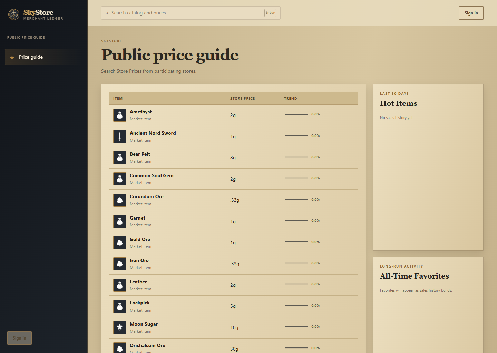
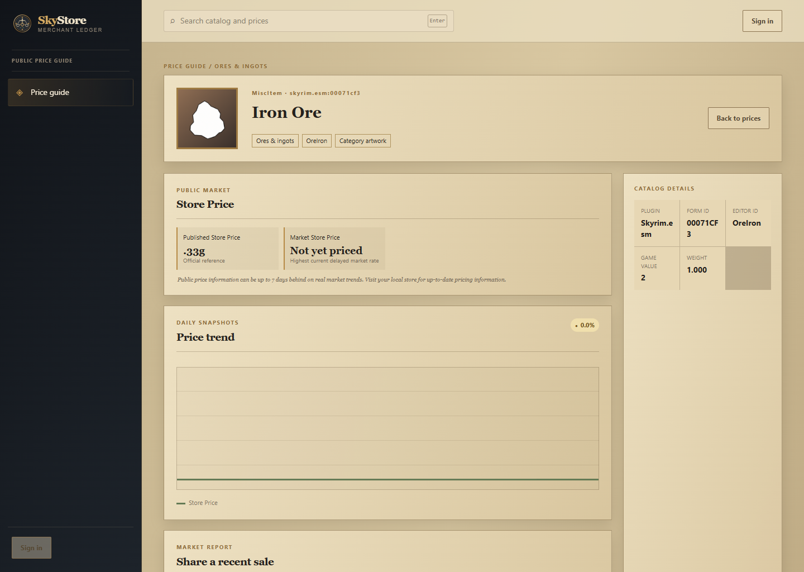
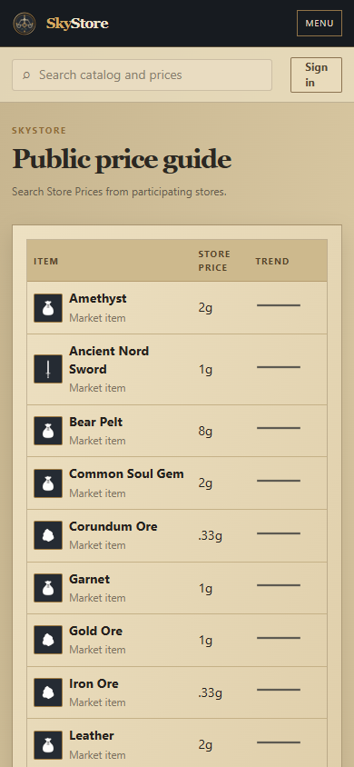

# SkyStore

SkyStore is a merchant ledger and market guide built for stores on the Keizaal Skyrim roleplay server. It helps store staff record completed in-game trades, reconcile stock, review prices, and share delayed market information without handling real payments, customer orders, or game inventory.

The public guide is available without an account and shows store selling prices only. Discord sign-in unlocks the current store ledger for assigned staff.

## Screenshots

| Public price guide | Public item detail |
| --- | --- |
|  |  |

<p align="center">
  
</p>

## What is included

- Public Store Prices, visual price trends, Hot Items, All-Time Favorites, catalog search, and item pages.
- Profession recipe browsers grouped by Novice, Advanced, Expert, and Master, with separate material cost and finished-product price columns plus explicit profession, recipe-book, perk, and alternative requirements.
- Private store buying and selling prices, street-price comparisons, current market information, and recommendations.
- Fast multi-line store-sale and store-purchase recording plus independent street-price reports.
- Stock tracking that never blocks a valid sale, with direct reconciliation to the real in-game inventory.
- Per-store approval queues, verified contributors, staff display names, reports, pricing targets, and immutable audits.
- Platform administration for stores, users, catalog activation, unresolved mappings, and quarantined contributors.
- A normalized Keizaal catalog containing 12,732 items and 3,014 extracted crafting records, including Keizaal profession and mastery gates.
- Consistent category artwork in dense lists, with offline NIF renders for craftable items and their materials on detail pages.

Public price information may be up to seven days behind current market activity. Private receipts, stock, staff identities, and store-specific evidence are never exposed through the public guide.

## Run with Docker

### Requirements

- Docker Desktop with Docker Compose.
- A Discord application for sign-in.
- The repository cloned locally.

In the Discord Developer Portal, add this local OAuth redirect URL:

```text
http://localhost:3000/api/auth/callback/discord
```

### 1. Configure SkyStore

Copy the example configuration:

```powershell
Copy-Item .env.example .env
```

Edit `.env` and replace every placeholder. `POSTGRES_PASSWORD` and the password embedded in `DATABASE_URL` must be identical.

```dotenv
POSTGRES_DB=skystore
POSTGRES_USER=skystore
POSTGRES_PASSWORD=<strong-random-password>
DATABASE_URL=postgres://skystore:<same-password>@postgres:5432/skystore

AUTH_URL=http://localhost:3000
AUTH_SECRET=<at-least-32-random-characters>
AUTH_DISCORD_ID=<Discord-application-client-id>
AUTH_DISCORD_SECRET=<Discord-application-client-secret>
SKYSTORE_ADMIN_DISCORD_ID=<numeric-Discord-user-id>
```

SkyStore keys users by their immutable Discord ID. The administrator ID becomes the platform administrator on first sign-in; staff can set a separate in-game display name inside each store.

### 2. Build, import the catalog, and start

```powershell
docker compose build
docker compose --profile setup run --rm catalog-import
docker compose up -d
docker compose ps
```

Open [http://localhost:3000](http://localhost:3000). The public guide works immediately. Sign in with the Discord account configured as `SKYSTORE_ADMIN_DISCORD_ID` to create the administrator membership and activate Whiterun General Store.

The first administrator login installs the supplied August 5, 2026 Whiterun reference prices. It does not create fake users, receipts, stock, sales, or market activity.

Verify the running application:

```powershell
Invoke-RestMethod http://127.0.0.1:3000/api/health/ready
```

## Item-specific images

Every item has a flat SkyStore category icon. The offline item renderer additionally creates transparent PNGs directly from the winning NIF ground models for profession recipe outputs, ingredients, and inventory-backed requirements. It does not start Skyrim, capture the game, scrape a website, or ship source game assets to the running application.

Run the [item renderer](tools/SkyStore.ItemRenderer/README.md) after extracting a refreshed catalog, then pass its `artwork-manifest.json` to the catalog builder for the final normalized bundle. Local Docker testing can copy the generated images into its catalog volume:

```powershell
docker compose --profile setup run --rm catalog-image-sync
docker compose --profile setup run --rm catalog-import
```

Release images receive the same rendered PNG set as an immutable, verified catalog bundle. See the [catalog image policy](docs/catalog-image-policy.md) for the exact scope and runtime boundary.

## Refresh the Keizaal catalog

Catalog extraction and rendering are intentionally separate from the website. The offline .NET tools read the exact Keizaal load order and Skyrim Data directory, resolve winning records and crafting recipes, extract only selected NIF/DDS dependencies, and emit normalized JSON plus transparent PNGs. Original plugins, archives, NIFs, and textures never enter Git or the Docker image.

Follow the [catalog builder instructions](tools/SkyStore.CatalogBuilder/README.md), place the generated bundle under `catalog/generated/`, then activate it explicitly:

```powershell
docker compose --profile setup run --rm catalog-import
```

The checked-in current bundle lets a fresh installation start with the known catalog; immutable versioned extractor copies remain local build artifacts.

## Local validation

The application uses Node.js 24, Next.js, React, PostgreSQL, Drizzle, Auth.js, Zod, and Vitest.

```powershell
npm ci
npm run lint
npm run typecheck
npm test
npm run build
```

## Deployment and data safety

The Compose stack runs the web application, PostgreSQL, a migration job, and a PostgreSQL-backed worker. Only the web service is bound to the host, on loopback by default. Production deployments should put an HTTPS reverse proxy in front of it and use the exact public Discord callback URL.

Tagged releases publish a Linux container to GitHub Container Registry and attach both a `stable`-channel TrueNAS SCALE YAML for normal updates and a digest-pinned YAML for immutable deployments. The release image contains the normalized current catalog and verified local item images; it never contains Skyrim plugins, archives, models, textures, or credentials. See the [TrueNAS deployment guide](deploy/truenas/README.md) for the prepared `/mnt/Atlantis/Vault/Skystore` layout, port `13000`, Nginx settings, Discord callback, and one-time automatic-update setup.

Never commit `.env` files, database dumps, uploads, backups, downloaded image caches, or source game files. Persistent Docker volumes retain PostgreSQL data, uploads, catalog images, and backup staging. Read [operations](docs/operations.md) before upgrading, exposing the service, or configuring encrypted off-site backups.

## Asset and license note

SkyStore's flat category icons and application branding were created for this project. Extracted game metadata and any optional game captures remain subject to their respective owners' rights and are not relicensed by this repository. No general source-code license has been granted unless a `LICENSE` file is added explicitly.
